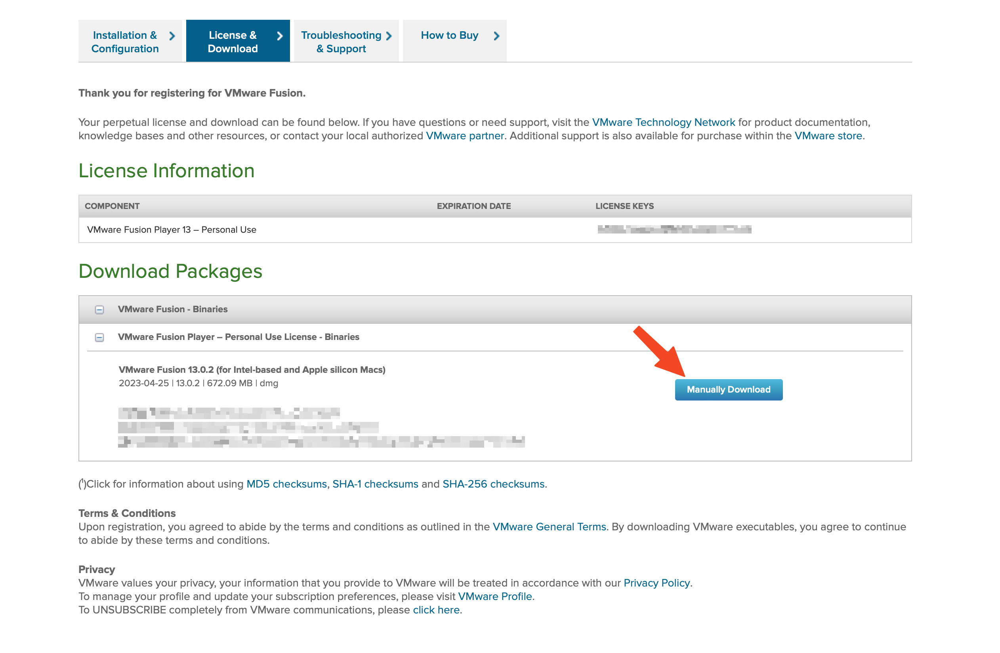
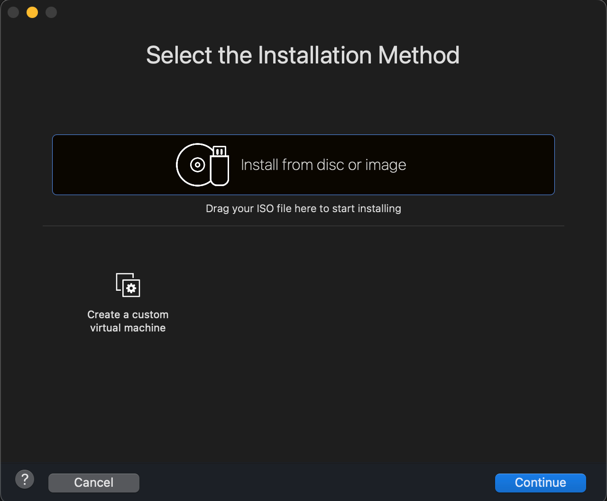
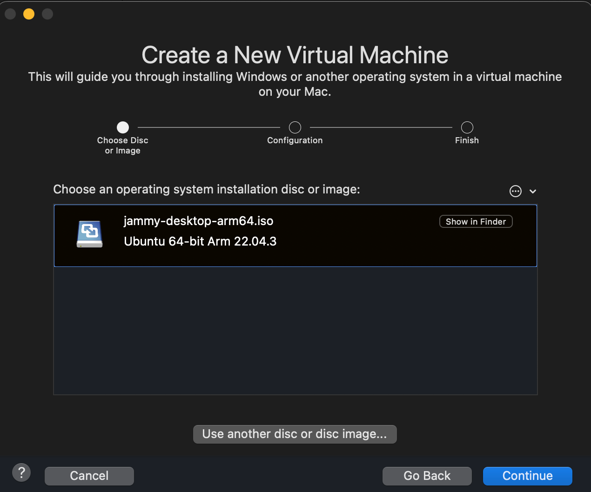
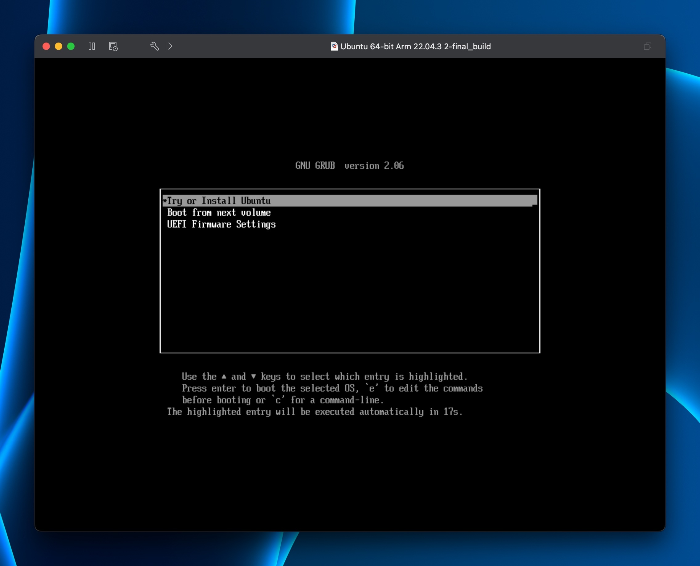
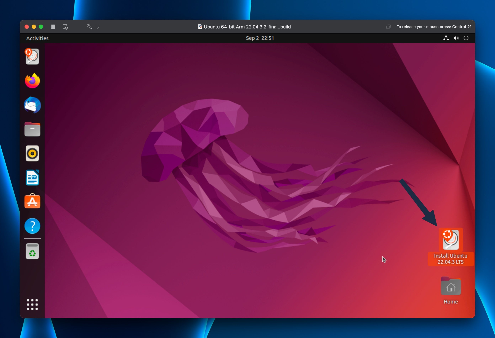
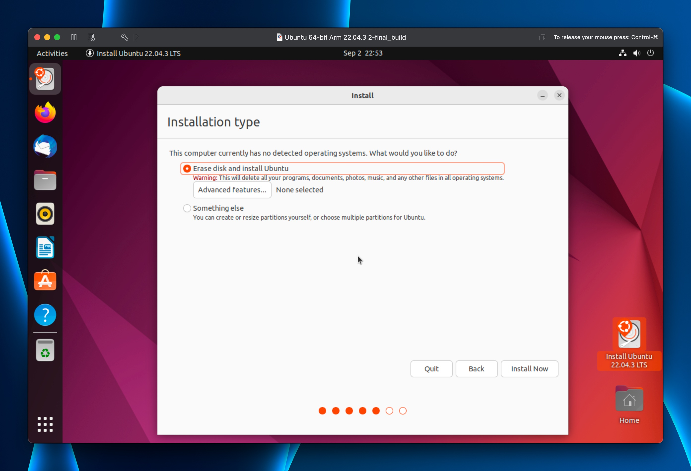
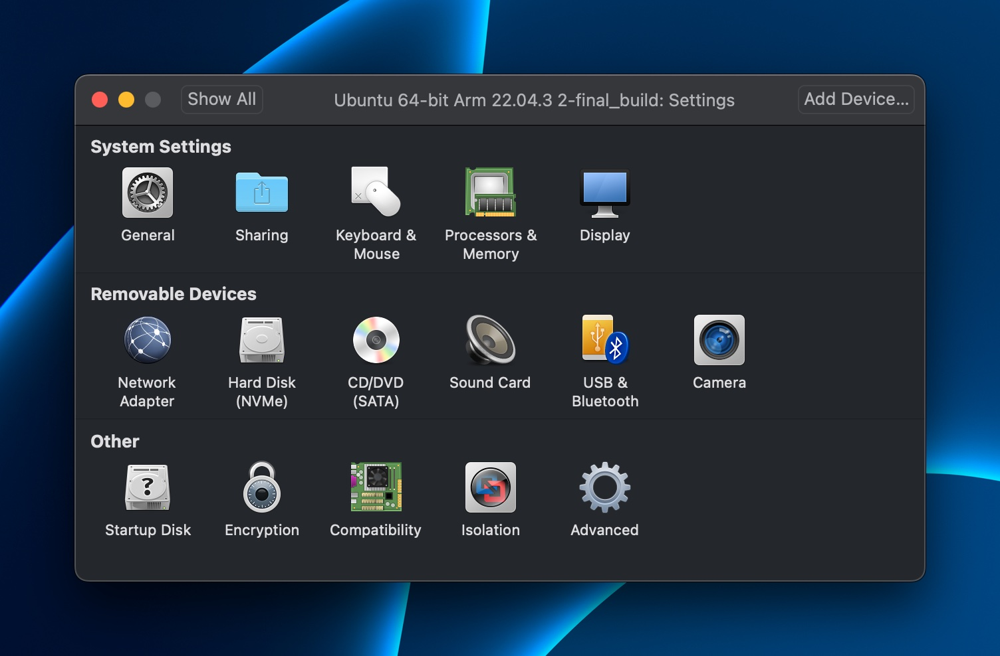

# Lab Setup for Apple Silicon Machines

## Step 1: Install VMware Fusion Player on Apple Silicon Machines

Go to [VMware Fusion](https://customerconnect.vmware.com/en/evalcenter?p=fusion-player-personal-13) and register for a free Fusion Player license. Then under License & Download, click on `Manually Download`.



Installation is straight forward. Download the dmg file manually from the link provided in the installation page. Double click on the dmg file and follow the instructions.

After the installation is finished, you can start the VMware Fusion Player. You will be asked to enter your license key which will be there on the installation page.

After you have entered the license key, you will be asked to allow the kernel extensions. Click on `Open Security Preferences`.

In the Security & Privacy settings, click on `Allow` to allow the kernel extensions.

## Step 2: Install Ubuntu on VMware Fusion Player

Now we have to download the Ubuntu ISO image. Go to [Ubuntu 22.04.3](https://cdimage.ubuntu.com/jammy/daily-live/current/) and download the Ubuntu 22.04.3 LTS (Jammy Jellyfish) Daily Build. Make sure you download the `64-bit ARM (ARMv8/AArch64) desktop image`.


After the download is finished, start the VMware Fusion Player. Click on `Create a New Virtual Machine`.

Now in Select the Installation Method, select `Install from disc or image` and click on `Continue`.



Select `Use another disc or disc image...` and click on `Continue`. Now select the downloaded Ubuntu ISO image and click on `Open`.



Now click on `Continue`. In the next screen, make sure that 2 CPUs and 4 GB of RAM are selected. Click on `Finish`.


The VM will be created and started. After the VM is started, click on `Try or insall Ubuntu`.



You will be greeted with Ubuntu home screen. As this is the test environment you will have to click on the `Install Ubuntu` icon on the desktop.



During Installation select Minimal Installation and click on `Continue`.


In the next screen, select `Erase disk and install Ubuntu` and click on `Install Now`.



Create a user with name `seed` and password `dees` and click on `Continue`.


The installation will start. After the installation is finished, click on `Restart Now`.

If the is giving an error, just remove the ISO image from the VM and restart the VM. To do that go to `Virtual Machine` -> `Settings` -> `CD/DVD (SATA)` and uncheck `Connect CD/DVD Drive`. Click on `Apply` and `OK`. Now restart the VM.



Now you will be greeted with the home screen. Go to terminal download curl using ```sudo apt-get install curl``` and follow the setup instructions from step 2 in the [README](../../manuals/cloud/seedvm-cloud.md) file.

## Step 3: Setup Docker and Docker Compose

After done with the setup we have to set the docker default platform to linux/arm64. Go to terminal and type the following command.

```export DOCKER_DEFAULT_PLATFORM=linux/arm64```

Docker-compose is not available for arm64 architecture. So we have to install it manually. Go to terminal and type the following commands.

```sudo curl -L "https://github.com/docker/compose/releases/download/v2.11.2/docker-compose-$(uname -s)-$(uname -m)" -o /usr/local/bin/docker-compose```

```sudo chmod +x /usr/local/bin/docker-compose```

Now you can use docker-compose in your VM.


