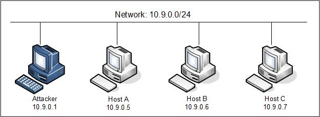

# Lab Environment Setup Using Docker Compose

In many of the SEED labs, we need several containers;
some labs may need more than 10 containers.
We can definitely create and run them one by one described
in the previous section, but as the number of containers
increases, the process become tedious.
Moreover, the network setup in some SEED labs
may also be quite complicated, so configuring them
becomes a challenge.


Fortunately, docker provides a tool called Compose, which
is for defining and running multi-container Docker applications.
In this section, we will use Compose to
create a lab environment setup that consists of a LAN
and containers. The setup is depicted in the following
Figure.




## Writing the ```docker-compose.yml``` file

With Compose, we use a YAML file called `docker-compose.yml`
to configure our containers. Then, with a single command,
we can create and start all the containers from your configuration.
The following is an example of the file.

```
version: "3"

services:
    HostA:
        build: ./ubuntu_base
        image: seed-ubuntu-base-image
        container_name: host-10.9.0.5
        tty: true
        cap_add:
                - ALL
        networks:
            net-10.9.0.0:
                ipv4_address: 10.9.0.5

    HostB:
        image: seed-ubuntu-base-image
        container_name: host-10.9.0.6
        tty: true
        cap_add:
                - ALL
        networks:
            net-10.9.0.0:
                ipv4_address: 10.9.0.6

    HostC:
        image: seed-ubuntu-base-image
        container_name: host-10.9.0.7
        tty: true
        cap_add:
                - ALL
        networks:
            net-10.9.0.0:
                ipv4_address: 10.9.0.7

networks:
    net-10.9.0.0:
        name: net-10.9.0.0
        ipam:
            config:
                - subnet: 10.9.0.0/24

```

Let us explain explain how it works.

- The `services` section lists all the
containers that we want to build and run 

- The `networks` section lists
all the networks that we need to create.
Each network is given a name, and the name
is used by the container entries.

- The `build` entry: This entry indicates that the container
image's folder name, and will use the `Dockerfile` inside to build
a container image. If a service does not have a `build` entry, 
it means the container does not need to build its own
image; it uses the existing image specified in the `image` entry.
It should be noted that one image can be used by multiple container instances.

- The `image` entry: The name of the image is specified in this entry. 
Without this entry, docker will generate a name for this image.

- The `container_name` entry: After building the image, Compose will start a container instance from this image,
and the name of the container instance is specified in this entry. 
In our naming convention,
we attach the IP address to the hostname.

- `tty: true`: Indicate that when running the container, use the
`-t` option, which is necessary for getting a shell prompt
on the container later on.

- The `networks` entry: It specifies the name of the networks that 
this container is attached to,
along with the IP address assigned to the container.
Multiple networks can be attached to a container.

**Note**: When Docker creates a network, it automatically
attaches the host machine (i.e., the VM) to the network, and gives
the `.1` as its IP address. Namely, for the
`10.9.0.0/24` network, the host machine's IP address is
`10.9.0.1`. Therefore, the host machine can directly
communicate with all the containers.


