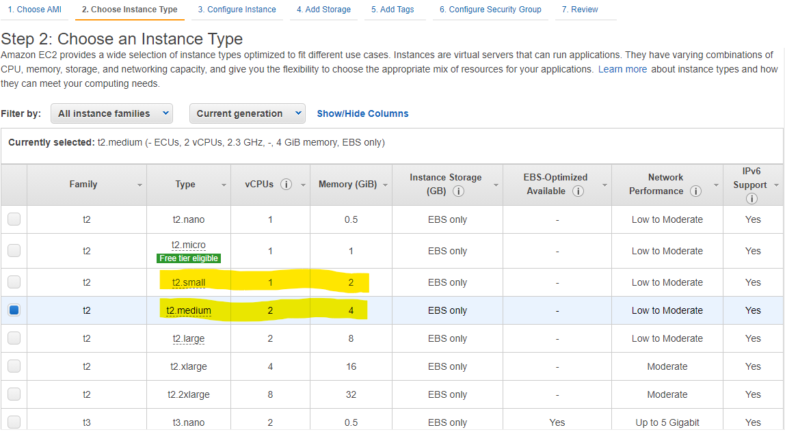
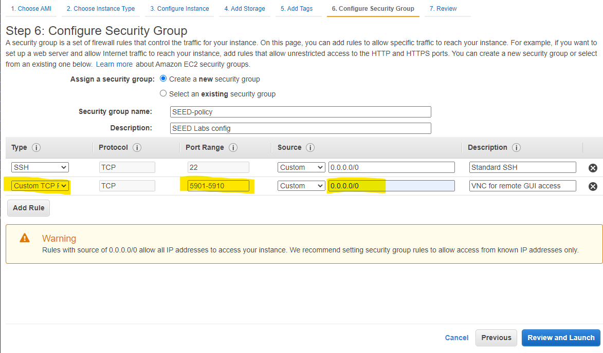
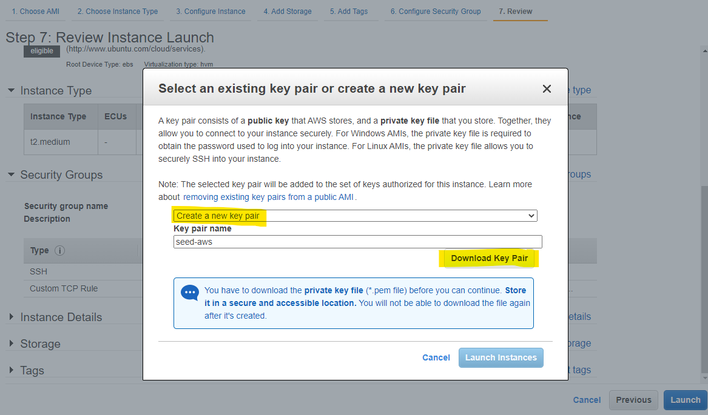
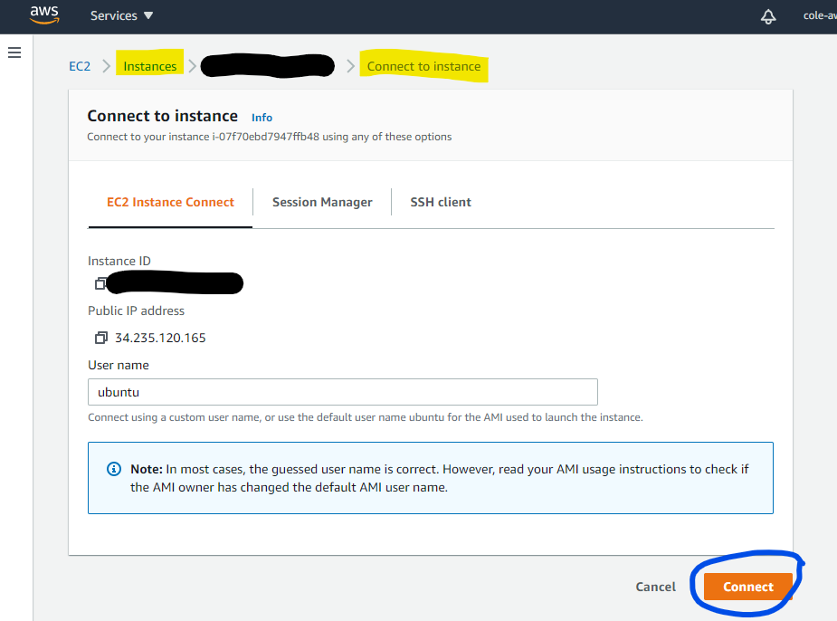

# Creating SEED VM on Amazon Web Services (AWS)

This folder stores the script that we use to build
a SEED 20.04 VM in AWS. This README file serves as the manual.

## Create VM Instance

When creating an EC2 instance, we suggest the following parameters:

- Instance: Ubuntu Server 20.04 64-bit (x86)

  

- Instance type: t1-medium recommendend (2 vCPUs, 4GB RAM), t1-small
  possible (1 vCPU, 2GB RAM)

  

- Security group: add policy for custom TCP connections, port range 5901-5910, src IPs 0.0.0.0/0

  

- Keypair: create new keypair

  

Download the private key (.pem file) to a secure location (e.g. the ~/.ssh/
directory). Change permissions on the .pem file to be read-only by owner, not visible to
any other (`chmod 400 <private key file>` on a Linux machine). 

## SSH into VM 

### From a Terminal:

Launch the AMI, then connect via SSH:

```
ssh -i <private key file> ubuntu@<external IP address of instance>
# example: ssh -i ~/.ssh/pk.pem ubuntu@12.34.56.78
```

### From a web browser

Use the AWS Console's "Connect to Instance" feature to connect through
a browser.

  

## Create `seed` User Account

By default, the username on an AWS Ubuntu instance is `ubuntu` , but we
want to be able to log in as the user `seed` and have sudo privileges as that user.
As the `ubuntu` user on the VM, execute the following commands to create
the `seed` user and add to the `sudo` group:

```
sudo adduser seed
sudo usermod -aG sudo seed
```

Follow prompts on the screen when adding the `seed` user. Be sure to
provide a secure password.

Log out and log in again as the `seed` user before continuing. 

## Software Intallation 

Now we can start installing the software for the SEED VM. 
Download the `seedvm_aws.zip` archive. To unzip it, we need to 
first install the `unzip` program: 
```
sudo apt update
sudo apt -y install unzip
```

Unzip `seedvm_aws.zip`, and run `install.sh`. Make sure 
to run this script inside the `seed` account because it 
will conduct some configurations on the account. 

```
./install.sh
```

This shell script will download and install all the software needed for 
the SEED labs. The whole process will take a few minutes. Please 
don't leave, because you need to manually make two decisions
during the installation:

- During the installation of Wireshark, you will be asked 
  whether non-superuser should be able to capture packets.
  Select `No`.

- During the installation of `xfce4`, you will be asked to 
  choose a default display manager. Choose `LightDM`. 

## Accessing the Desktop GUI

For most labs, being able to SSH into the VM should be sufficient.
Some labs do need to access GUI applications on the VM, such as 
Firefox and Wireshark. If your network bandwidth is not too 
bad, being able to access the desktop of the remote VM is 
always more desirable. 

To achieve that, we will VNC into the VM. 
There are two more things that you need to do:

- Install a VNC viewer software on your computer, such as 
  [TigerVNC](https://tigervnc.org/). 
  This viewer software is the VNC client program. 
  The TigerVNC server program is already installed on the VM.   

## Start the VNC server

Inside the `seed` account on the VM, you can now run `vncserver` 
to allow yourself to VNC into the `seed` account
on this VM from the outside. You can start the server by 
running the following command (the TigerVNC server is installed 
by the installation script): 
```
vncserver -localhost no
```

By default, TigerVNC server only listens to localhost/127.0.0.1. 
The purpose of the `-localhost no` option means accepting 
access from the outside. When we first start the `vncserver`, 
we will be asked to provide a password. Make sure this password 
is strong enough. Moreover, VNC communication itself is not 
encrypted, so you should not send anything personal. If you 
do want to secure it, you can run an SSH tunnel or VPN tunnel
to protect the VNC communication.

Here are some commands to help you list and kill VNC
server sessions:

```
vncserver -list       # List the VNC server sessions
vncserver -kill :1    # Kill the session for :1 display
```

From your computer, you can start your VNC viewer program,
and type the IP address of the VM, along with the port number, 
such as `35.236.212.171:5901`. Make sure to use the 
external IP address of your VM, not the internal one. If everything
is set up correctly, you will see the desktop of your 
remote VM.

