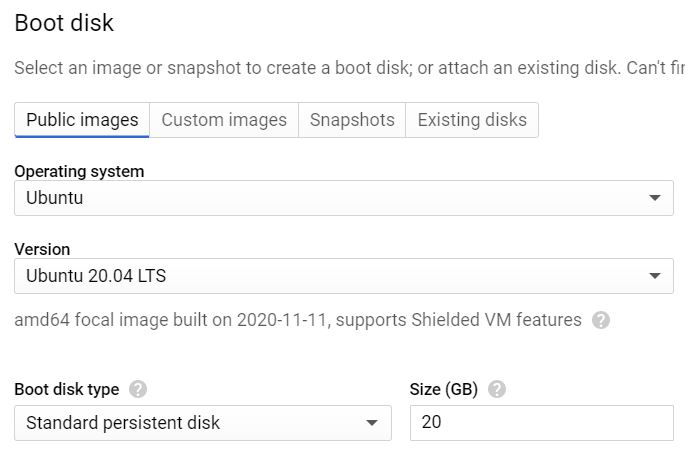

# Creating SEED VM on Google Cloud 

This folder stores the script and files needed for building a SEED VM on
the Google Cloud. This README file serves as the manual.

## Create VM Instance

Creating a VM instance on Google cloud is quite straightfoward. 
When you create the VM instance, we suggest the following parameters: 

- Machine configuration: 2 vCPU and 4GB of memory should be sufficient. 
  However, one core and 2GB should be OK.

   

- Book disk: Operating system (Ubuntu) and Version (Ubuntu 20.04 LTS). 
  Disk size (20 GB). 

   


## SSH into VM and Create `seed` Account

Once the VM instance is built and started, you can ssh into the VM from the browser. 
By default, a username for SSH sessions is generated from the
email address logged into the account, omitting the domain information. For
example, if an email is `bob@gmail.com`, the corresponding username would be
`bob`.

It is better to create an account for `seed`, and change the default username 
for SSH session to `seed`. You can achieve it by clicking the gear icon
on the top-right corner of the SSH window (see the following). 


On the drop-down menu, select
`Change Linux Username`, and type `seed`. A new account called `seed` will be 
created on the VM, you will be logged ino that account. In the future,
when you SSH into the VM from the browser, the default user name
will be `seed`.  


## Software Intallation 

Now we can start installing the sftware for the SEED VM. 
Download the `seedvm_gcp.zip`. To unzip it, we need to 
first install the `unzip` program: 
```
sudo apt update
sudo apt -y install unzip
```

Unzip `seedvm_gcp.zip`, and run `install.sh`. Make sure 
run run this script inside the `seed` account because it 
will conduct some configurations on the account. 

```
./install.sh
```

This shell script will download and install all the software needed for 
the SEED labs. The whole process will take a few minutes. Please 
don't leave, because you do to manually make two decisions
during the installation:

- During the installation of Wireshark, you will be asked 
  whether non-superuser should be able to capture packets.
  Select `No`.

- During the installation of `xfce4`, you will be asked to 
  choose a default display manager, chose `LightDM`. 


## Accessing the Desktop GUI

For most labs, being able to SSH into the VM should be sufficient,
Some labs do need to access GUI applications on the VM, such as 
Firefox and Wireshark. If your network bandwidth is not too 
bad, being able to access the desktop of the remote VM is 
always more desirable. 

To achieve that, we will VNC into the VM. 
There are two more things that you need to do:

- Install a VNC viewer software on your computer, such as 
  [TigerVNC](https://tigervnc.org/). 
  This viewer software is the VNC client program. 
  The TigerVNC server program is already installed on the VM.   

- By default, Google cloud does not allow VNC traffics, 
  we need to set up a firewall rule on to allow that.
  See [this link](https://cloud.google.com/vpc/docs/using-firewalls) for 
  instructions on how to add firewall rules. 
  Use the following parameters for your firewall rule (the default port 
  for VNC server is `5901'):
  ```
  Type: Ingress
  IP ranges: 0.0.0.0/0
  Protocol/port: tcp:5901-5910
  ```

## Start the VNC server

Inside the `seed` account on the VM, you can now run `vncserver` 
to allow yourself to VNC into the `seed` account
on this VM from the outside. You can start the server by 
running the following command (the TigerVNC server is installed 
by the installation script): 
```
vncserver -localhost no
```

By default, TigerVNC server only listens to localhost/127.0.0.1. 
The purpose of the `-localhost no` option means accepting 
accesses from the outside. When we first start the `vncserver`, 
we will be asked to provid a password. Make sure this password 
is strong enough. Moreover, VNC communication itself is not 
encrypted, so you should not send anything personal. If you 
do want to secure it, you can run a SSH tunnel or VPN tunnel
to protect the VNC communication.

Here are some commands to help you list and kill VNC
server sessions:

```
vncserver -list       # List the VNC server sessions
vncserver -kill :1    # Kill the session for :1 display
```

From your computer, you can start your VNC viewer program,
and type the IP address of the VM, along with the port number, 
such as `35.236.212.171:5901`. Make sure to use the 
external IP address of your VM, not the internal one. If everything
is set up correctly, you will see the desktop of your 
remote VM.


