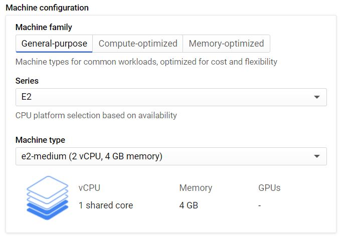

# Creating a VM Instance on Google Cloud


Creating a VM instance on Google cloud is quite straightforward.
When you create the VM instance, we suggest the following parameters:

## Step 1: Machine configuration 

2 vCPU and 4GB of memory is more desirable. However, 
1 vCPU and 2GB is sufficient for most SEED labs. You can
easily change the machine configuration later after the machine
is created. 




## Step 2: Boot disk 

Choose the Ubuntu 20.04 LTS operating system.
For the disk size, 20 GB is more desirable, but 10 GB is 
sufficient (you may have to do some cleanup if the disk
becomes full).


## Step 3: Set up Firewall Rules

You need to set up firewall rules, so you can connect to the VM from the 
outside. You can find detailed instructions from 
the [official Google document](https://cloud.google.com/vpc/docs/firewalls) 
and other online tutorials. 
There are two essential rules that we need to set, one for SSH (which is 
usually already set by the cloud), and the other is for VNC.
Their port numbers are described in the following: 

```
SSH: Allow ingress traffic to TCP port 22
VNC: Allow ingress traffic to TCP port 5901 - 5910
Note: VNC servers use port 5900 + N, where N is the display number.
```


## Notes


Keep an eye on your bill. Sometimes, there are costs that you may 
not be aware of, such as bandwidth cost, storage cost, etc. 
Understanding where your expense is can help you reduce it. 
Moreover, to avoid wasting money, remember to 
suspend your VMs if you are not working on them. Although a 
suspended VM still incurs storage cost (usually very small), it 
does not incur any computing costs. You can easily resume them
when you are ready to continue your work.
