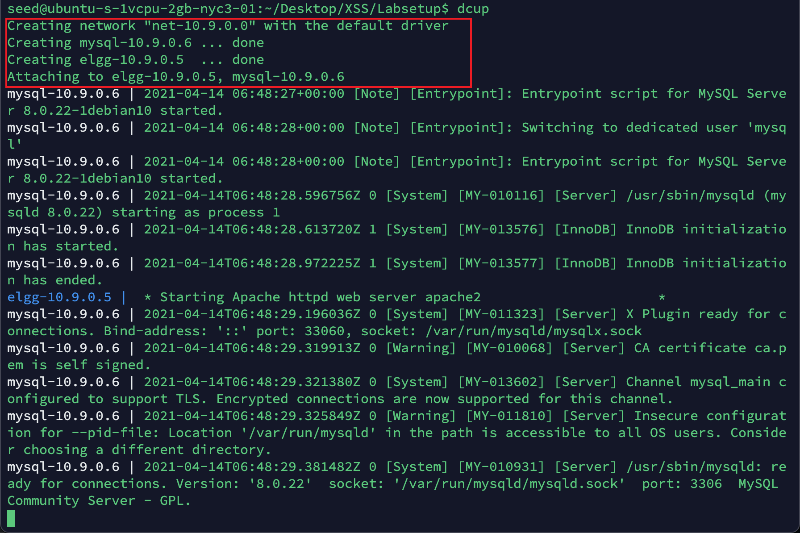

# What should do when forget turn off the previous container?

## What error you may meet
Usually when you forget turn off the previous containers and accidentally has ```dcup```, i.e ```docker-compose up``` another lab containers, you will meet some error.


For example, in my case, in previous XSS lab, I maintain two containers "elgg-10.9.0.5", "mysql-10.9.0.6" and a  network "net-10.9.0.0". Two container are connecting on network.



Unfortunately, I forget use ```dcdown``` to shut down these containers before I start the SQL injection Lab. When I type ```dcup``` which try to start up the new containers for SQL injection lab.

An error message pop up, says "Cannot start service www: Address already in use". That is because the address "10.9.0.5" is occupied by the XSS lab's containers.


Then I try to type the ```dcdown```, i.e. ```docker-compose down``` to shut down the XSS lab's containers. Another error message shows "error while removing network: .... active endpoints".


The reason behind is that the accidentally ```dcup``` messed up the relationship between each containers. It makes several containers become orphan containers which cannot be removed properly by ```dcdown``` command. And they are still connecting to the "net-10.9.0.0", so network "net-10.9.0.0" are still active and cannot be removed.

So the solution is as following:

## Step 1: disconnect the network with containers

First you need to check the network information using ```docker network ls ```


Because we have already know the target network we want to disconnect is "net-10.9.0.0", so we need to inspect which containers are connecting with this network using ```docker network inspect ${NetworkName}```. In my case, ```${NetworkName}``` is "net-10.9.0.0".


You can find which containers are still connect on this network. In my case, there is only one container called "elgg-10.9.0.5" are connecting.

Then You need to use ```docker network disconnect -f ${NetworkName} ${ContainerName}``` to disconnect the network. In my case, ```${NetworkName}``` is "net-10.9.0.0" and ```${ContainerName}``` is "elgg-10.9.0.5".


You inspect the network again, you can find the containers part is empty, that means you have disconnect it successfully.

NOTE: ```docker network disconnect -f ${NetworkName} ${ContainerName}``` only accept exactly two parameters, which means each time we can only disconnect network with one containers. If your network are connecting with several containers, you need to run it several times to disconnect them all.

Once you disconnect the network, you can remove the network properly using ```dcdown```


## Step 2: Remove the orphan containers

Based on the WARNING part or if you run ```dockps```, you will find there are orphan containers. In my case, there is only one called "elgg-10.9.0.5"

You can use ```docker-compose up --remove-orphans``` to clean it up. When you start up your new containers, the orphan containers will be automatically removed.

Or you can manually clean these containers. This manually method can force remove any containers, even they are not orphans.

You use ```docker ps -aq``` to check the docker are still running. It will run the id of running containers.


Then you need to use ```docker stop ${ContainerID}``` to stop them first. ```${ContainerID}``` can be omitted to the head part once the system can distinguish the id is unique for particular container. In my case, even ```docker stop 0``` works well. The result of this command is the stopped container id.


Now You can force remove the container using ```docker rm -f ${ContainerID}```. The result of this command is the stopped container id. And you can use ```docker ps -aq``` again to make sure it has been removed.


NOTE: If you have several orphan containers you want to remove. You need to keep running these command several times.
```
docker stop ${ContainerID}
docker rm -f ${ContainerID}
```

Now, you can ```dcup``` i.e. ```docker-compose up``` to start your container successfully!


